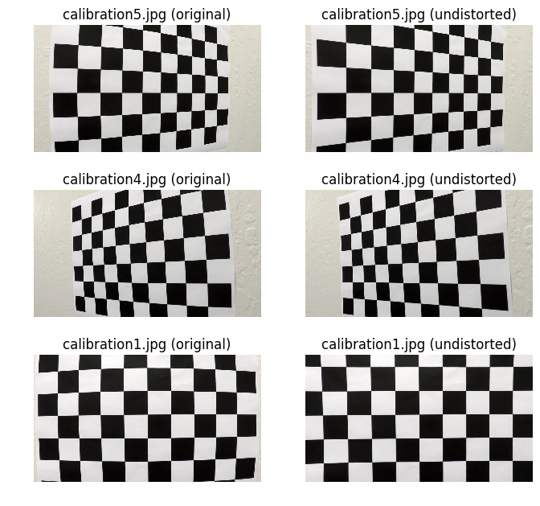
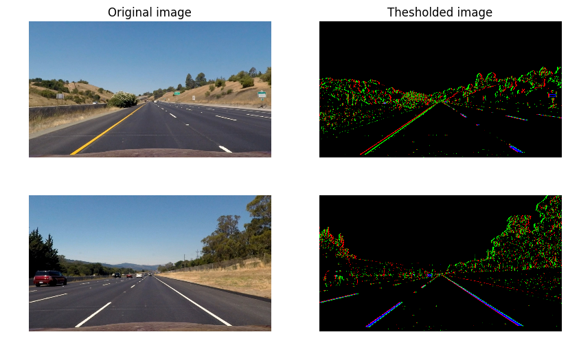
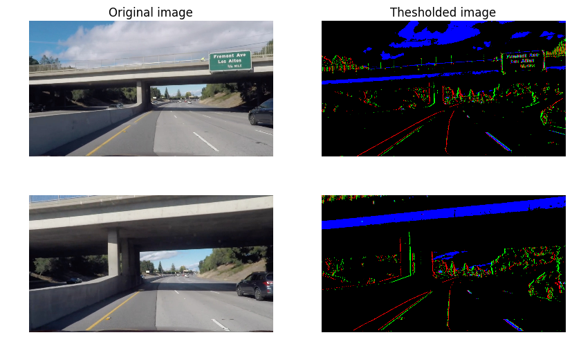
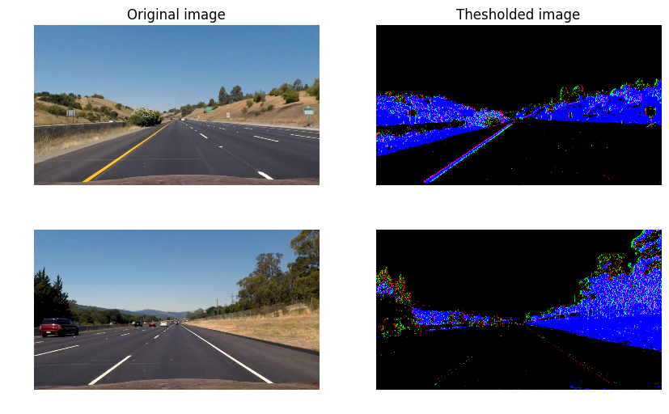
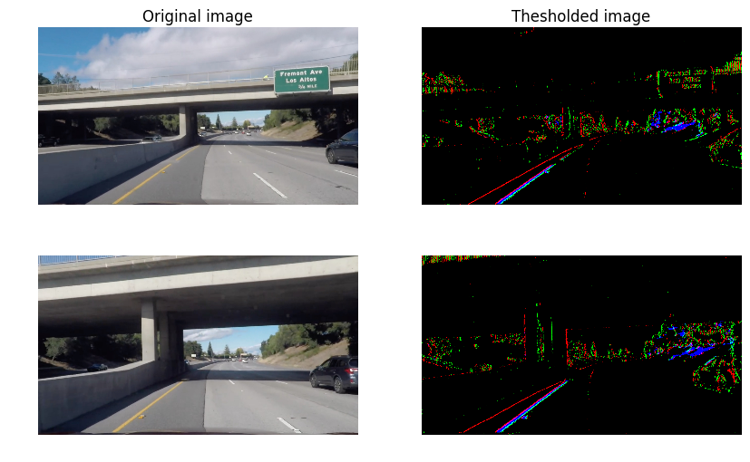
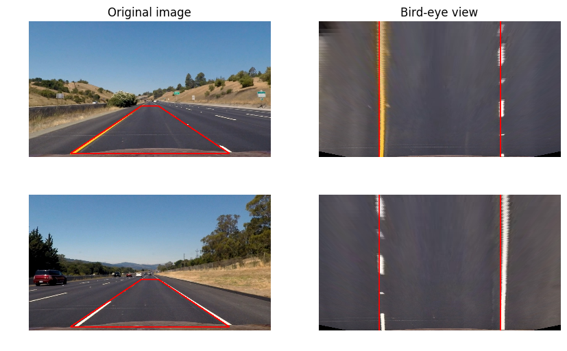
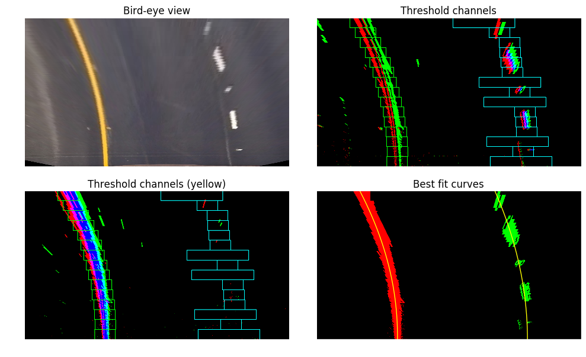
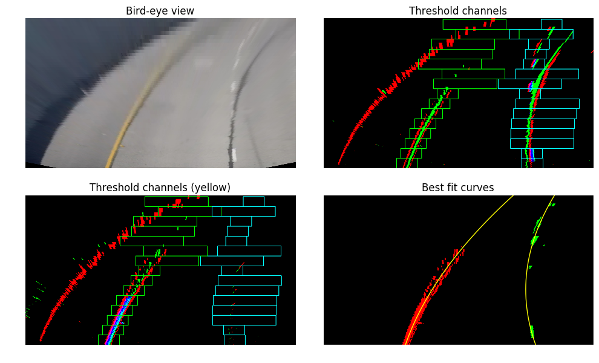
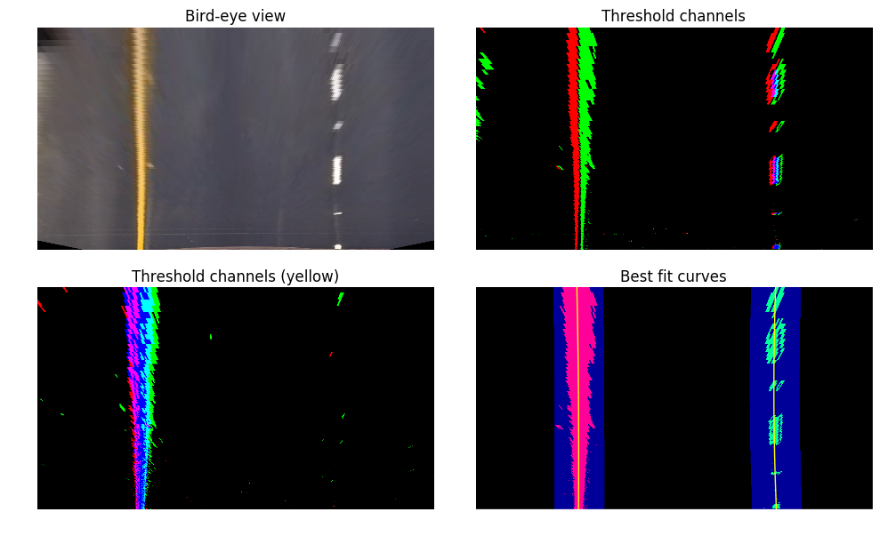
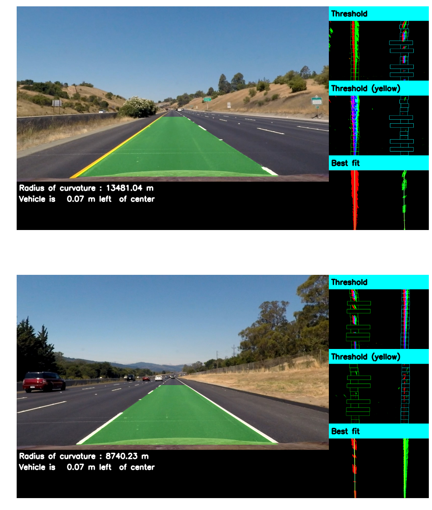

## Advanced Lane Finding
In this project, our goal is to write a software pipeline to identify the lane boundaries in a video. Following steps were implemented to acheive the goal :

* Compute the camera calibration matrix and distortion coefficients given a set of chessboard images.
* Apply a distortion correction to raw images.
* Use color transforms, gradients, etc., to create a thresholded binary image.
* Apply a perspective transform to rectify binary image ("birds-eye view").
* Detect lane pixels and fit to find the lane boundary.
* Determine the curvature of the lane and vehicle position with respect to center.
* Warp the detected lane boundaries back onto the original image.
* Output visual display of the lane boundaries and numerical estimation of lane curvature and vehicle position.

The project consists of following files : 

* `calibrate.py` : The script for camera calibration.
* `lane_detection.py` : The script for applying color and gradient thresholds, applying perspective transformation and detect lane pixels.
* `pipeline.py` : The main script which performs lane detection analysis on video frames.    
* `Project.ipynb` : IPython notebook with step-by-step description and execution of entire code. 

--

### Camera calibration
The code for this step is contained in the file `calibrate.py` wherein the relevant class to handle all operations is called `calibration`. 
I start by reading all the chess board images using `calibration.add_image()` function. The "object points", which will be the (x, y, z) coordinates of the chessboard corners in the world, is fixed on the (x, y) plane at z=0, such that the object points are the same for each calibration image. Thus, `calibration.obj_points` is appended with a copy of the same coordinates every time I successfully detect all chessboard corners in a test image using the function `calibration.find_corners()`. `calibration.img_points` will be appended with the (x, y) pixel position of each of the corners in the image plane with each successful chessboard detection. Corners for all but three of the images were detected, here are four examples : 

Note that three of the images did not have all the 9x6 corners which will be used to test calibration.

I then used the output `calibration.obj_points` and `calibration.img_points` to compute the camera calibration and distortion coefficients in the function using the `cv2.calibrateCamera()` function (please see `calibration.calc_distortion()` for details). I applied this distortion correction to the test image using the `cv2.undistort()` function (please see `calibration.undistort_img()` for details) and obtained the following result for the three test images : 

--

### Thresholding
I used a combination of color and gradient thresholds to split image into 7 binary channels (please see `lane_detection.split_channels()` function on line 35 of the file `lane_detection.py`). Images are first converted to HSV color space and 7 channels are selected : 4 of these channels are obtained by applying Sobel gradient along x-direction on 'S' and 'V' of HSV keeping the sign of threshold instead of taking absolute values i.e. positive and negative gradient thresholds. The 'S' gradient allows us to pick up yellow line edges while 'V' gradient thresholds pick both white and yellow edges. The other 3 channels are obtained by applying color thresholds, 'H' color threshold for picking yellow and 'V' threshold for picking white color (I used two thresholds for white in case one fails). Here are the results of applying gradient thresholds on 'V' channel and white color selection: 

     
 

From the above images, it can be seen that using positive and negative gradients allows us to differentiate between lane lines from shadow lines and other irrelevant road markings. Concretely, for lane lines, positive and negative threshold lines always appear in vicinity.
Here are the results for applying gradient thresholds on 'S' channel and yellow color selection: 

     

--

### Perspective transform
The code for my perspective transform includes a function called `lane_detection.warper()`, which appears on line 12 in the file `lane_detection.py`. The source and destination points were chosen as follows:

| Source        | Destination   |
| ------------- |:-------------:| 
| (225,700)     | (320,720)     |
| (590,450)     | (320,-100)    |
| (690,450)     | (960,-100)    |
| (1055,700)    | (960,720)     |

I verified that my perspective transform was working as expected by drawing the source and destination points onto test images and its warped counterpart to verify that the lines appear parallel in the warped image. 

 

--

### Lane detection
Two approaches were implemented for finding lane lines. The first approach is the window sliding method which is used when prior lane information does not exist or missing. Although this appraoch is often more robust, it is also computationally time consuming. The other approach is searching for lane pixels in a target region determined by the previous window frame. The second approach is less compuationally intensive and is used for most of the video frames. 

The window sliding method is implemented in `lane_detection.sliding_window()` function on line 231 of the file `lane_detection.py` using 15 windows for each side of the lane. Information from all 7 channels of the thresholding step is utilized. 
For example, I require that positive gradient edges be accompanied by negative gradient edges, which allows for differentiating lane markings from shadows. For full selection criteria, see the function `lane_detection.get_good_pixels()` on line 107 of `lane_detection.py`.  Here are the results on a test image : 

 
As seen above, a more targeted search window is used when relevant pixels are detected. To demonstrate the working of our thresholding, here is one from a more challenging test image: 

In order to fit curves to "good" pixels, I have used `numpy.polyfit` function to fit a second order polynomial, implementation of which can be found in the function `lane_detection.curve_fit()` on line 348 of `lane_detection.py`. Concretely, the best fit curves are parametrized as follows :
$$x = A y^2 + B y + C$$
Once the lane pixels have been detected using sliding window method, a targeted search is performed in subsequent video frames by focusing on region around the best fit curves from the previous frame (see `lane_detection.target_search()` on line 405 of `lane_detection.py` ). Here is an example : 

--

### Lane parameters
To calculate lane parameters, measurement units have to be changed from pixels to real world units such as meter. I use the following conversion : $k_x=3.7/700$ m/pixel in the x-direction and $k_y=30/720$ m/pixel.

* Radius of curvature : The radius of curvature is implemented in `lane_line.calc_R()` function on line 72 of `pipeline.py`. Since, the original fit was performed in the pixel space, I use the following formula for conversion to real world space :
	$$ R = \frac{(k_x^2 + k_y^2(2Ay+B)^2)^{3/2}}{2 k_x k_y |A|}$$ 
	
* To find the position of the vehicle with respect to the center, I calculate the x-coordinate of both the left and right lane lines with repect to the center at the base of the image. The average of the two x-coordinates is the position of the center of the road with respect to the camera center. 

-- 

### Final output
To store the history of video frames, I have implemented a class `lane_line` which can be found in `pipeline.py` on line 17. The final pipeline is implemented in the function `pipeline(img)` (also to be found in `pipeline.py` on line 132) which takes as input video frame `img`. In this function, I toggle between two methods for finding lane line pixels : window sliding method is used for the first few frames and every 10th frame while a targetted search is used when lane markings were found in the previous video frame. Several checks are performed to check if the best fit curves actually make sense :

* Fit parameters are required to not be significantly different from previous frame.  
* Left and right lane lines should not be diverging.
* The base gap between left and right lines should not be too large or too small. 
* The residuals from curve fit (normalized by the number of pixels found) should not be too big. 

 Further, I have implemented averaging of the fit parameters over last few iterations so as to avoid jittery lines. 

Here are a couple sample output images :   

Here is the final output video : 

   

and here is one on a more challenging road : 

 

--

### Discussion
The most challenging aspect of this project was the shadows and road markings, specially on the challenging video. I was able to deal with this issue by requiring that positive and negative gradients be in vicinity. The shadows and irrelavant road markings usually have either positive gradients or negative gardient edges but not both unlike the lane markings which have both. 

However, there is a lot of scope for improvement which I hope to address in the future (currently not implemented due to lack of time) :

* Use of convolution to select hot pixels can help in removing outliers.
* The consistency checks can be made more robust. In particular, currently they do not work well when roads are curvy as in the harder challenge video.
* It might be worth exploring more thresholds such as gradient directions.  
* Information about yellow and white markings can be easily included.     
 